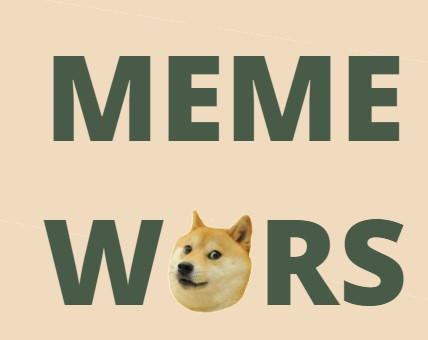
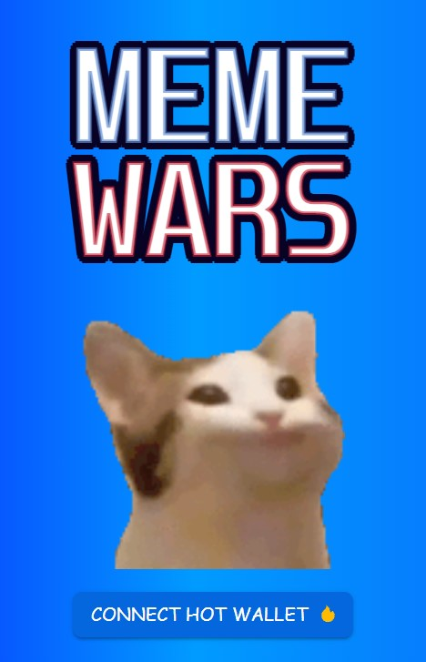
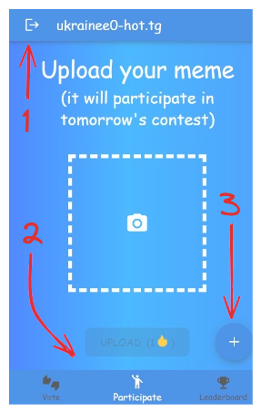
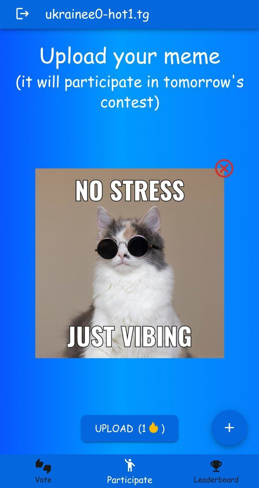
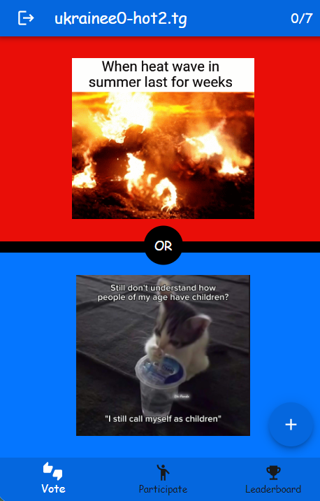
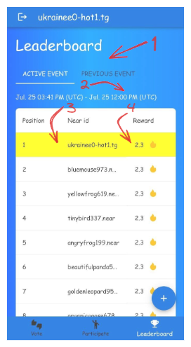
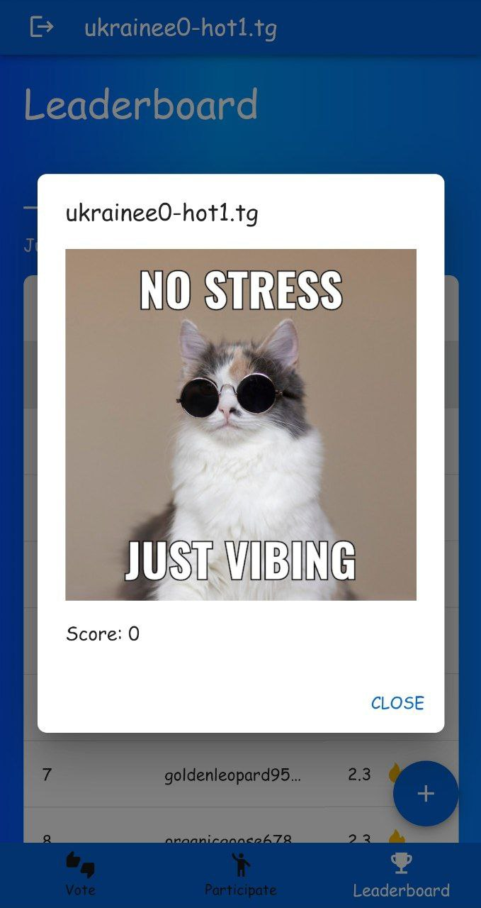
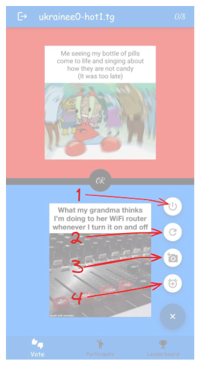

<!-- PROJECT LOGO -->

 

  <a href="https://github.com/IvanNugiban/meme-wars">

    
  </a>

  <h3 align="center">Meme Wars</h3>

  

    A social app  for meme creators and enthusiasts!
     

<!-- TABLE OF CONTENTS -->

  
Table of Contents

  <ol>
     <li>
      <a href="#video">Video</a>
    </li>
    <li>
      <a href="#about">About</a>
      <ul>
        <li><a href="#login-page">Login page</a></li>
        <li><a href="#interface">Interface</a></li>
        <li><a href="#submission-page">Submission page</a></li>
        <li><a href="#vote-page">Vote page</a></li>
        <li><a href="#leaderboard-page">Leaderboard page</a></li>
         <li><a href="#admin-menu">Admin menu</a></li>
        <li><a href="#built-with">Built With</a></li>
      </ul>
    </li>
    <li><a href="#roadmap">Roadmap</a></li>
    <li><a href="#links">Links</a></li>
  </ol>

## Video

<!-- ABOUT THE PROJECT -->
## About

Meme Wars is a mini Telegram app based on Hot Wallet for Hot Hackathon, where users share memes and vote for others, moving up the leaderboard and earning rewards.

### Login Page

On this page you can login to app via hot wallet. Pretty simple.

### Interface

**1 - Logout.**  
**2 - Navigation to : vote, sumbission and leaderboard page.**  
**3 - Admin menu. A little bit later about it.**

## Submission Page

  

On this page, users can upload their meme (gif or picture) and enter tomorrow's contest. He should also pay 1 hot for it, but since it is not realizable yet, participation is free. A user can only submit 1 meme for 1 event. Later, at the beginning of the contest, other players will be able to vote for this meme and the one who uploaded it will get a chance to be at the top of the leaderboard.

## Vote Page

  

On this page, users can vote for memes in the popular “Would you rather” format. The meme for which the user voted gets upvote and is promoted in the leaderboard, the other meme does the opposite. In the upper right corner you can see the limit of votes for this event, it depends on the total number of entries and is necessary that the user did not vote for the same meme several times and could not do it indefinitely. Also for the use of all votes is supposed to be rewarded, for example in the same token HOT, but again it is not realizable (so far).

## Leaderboard Page

**1 - Switch leaderboard (to prev or to current event).**  
**2 - Event period**  
**3 - User submission (if there is one). It will always be on top and highlighted by yellow, regardless of position.**  
**4 - Potenial reward**

The leaderboard is updated every 5 minutes and sorts entries by the number of votes. Also awards are dynamically distributed from the pool (that is, it is not even necessary to allocate other hot, the pool is completely self-exhausting, that is, for example, the top 40% will receive an award, and the rest will not). You can also click on a position in the leaderboard and see more details:

After the end of the event, a new one will start and rewards will be given for the old one (you can see the past event by switching to it above).

## Admin Menu

Since the application implies a large number of active users, to show the capabilities of the application, I added a small menu where you can do the following:

**1 - Finish current event and start new (at least 20 entries required to start new event, add them via 4th action)**  
**2 - Refresh leaderboard**  
**3 - Add new entries (20) for current event. P.S these entries are just random memes API and random usernames API, not actual users**  
**4 - Add new entries for next event.**

(<a href="#readme-top">back to top</a>)

### Built With

* ![React][React.js]
* ![Typescript][Typescript]
* ![Material UI][MaterialUI]
* ![Mobx][Mobx Badge]
* ![Express][Express Badge]

(<a href="#readme-top">back to top</a>)

<!-- ROADMAP -->
## Roadmap

- [x] Added leaderboard
- [x] Add voting
- [x] Added admin menu
- [ ] Add actual rewards for winning
- [ ] Add user profile where you can see all your memes and stats.
- [ ] Improve UI

(<a href="#readme-top">back to top</a>)

<!-- CONTACT -->
## Links

[Server Repository](https://github.com/IvanNugiban/meme-wars-server)

Twitter - [@IvanNugiban](https://twitter.com/IvanNugiban).

Telegram - @ukrainee0.

(<a href="#readme-top">back to top</a>)

[React.js]: https://img.shields.io/badge/React-20232A?style=for-the-badge&logo=react&logoColor=61DAFB

[Typescript]: https://img.shields.io/badge/TypeScript-3178C6?style=for-the-badge&logo=typescript&logoColor=white

[MaterialUI]: https://img.shields.io/badge/Material%20UI-007FFF?style=for-the-badge&logo=mui&logoColor=white

[Mobx Badge]: https://img.shields.io/badge/MobX-F95?logo=mobx&logoColor=fff&style=flat

[Express Badge]: https://img.shields.io/badge/Express-000?logo=express&logoColor=fff&style=flat